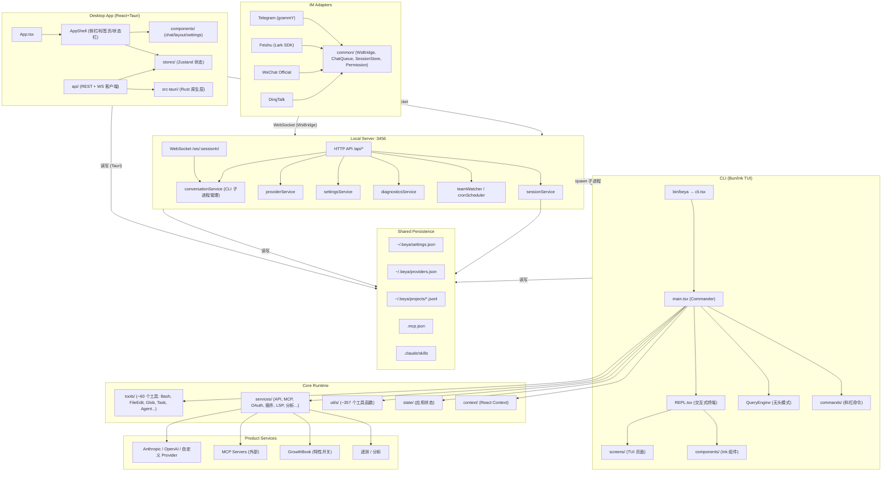
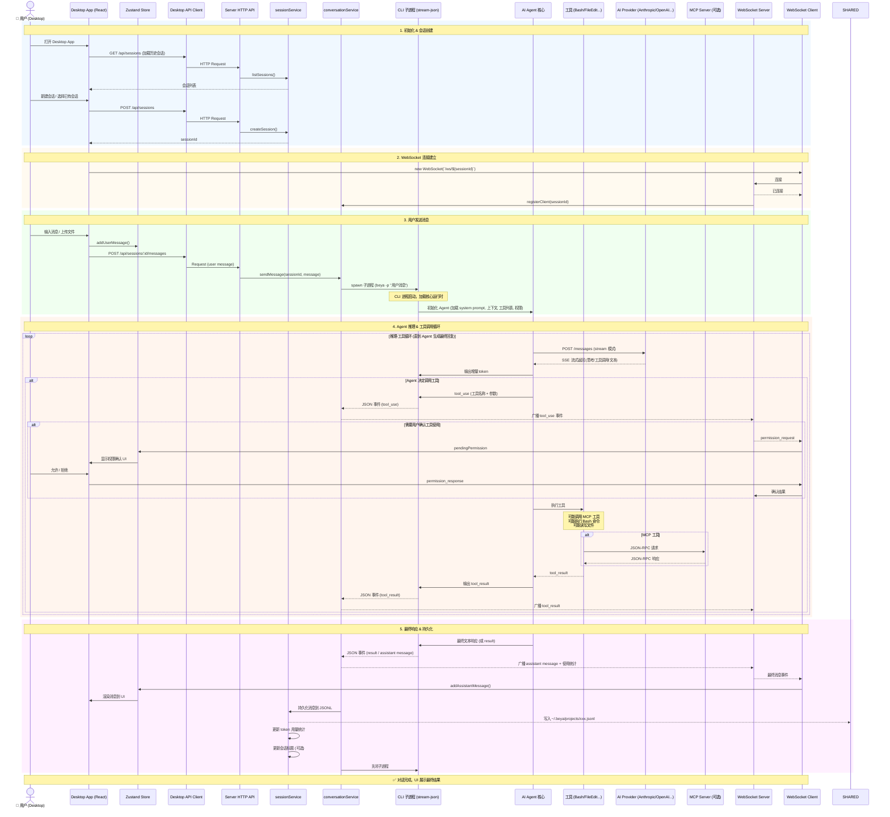
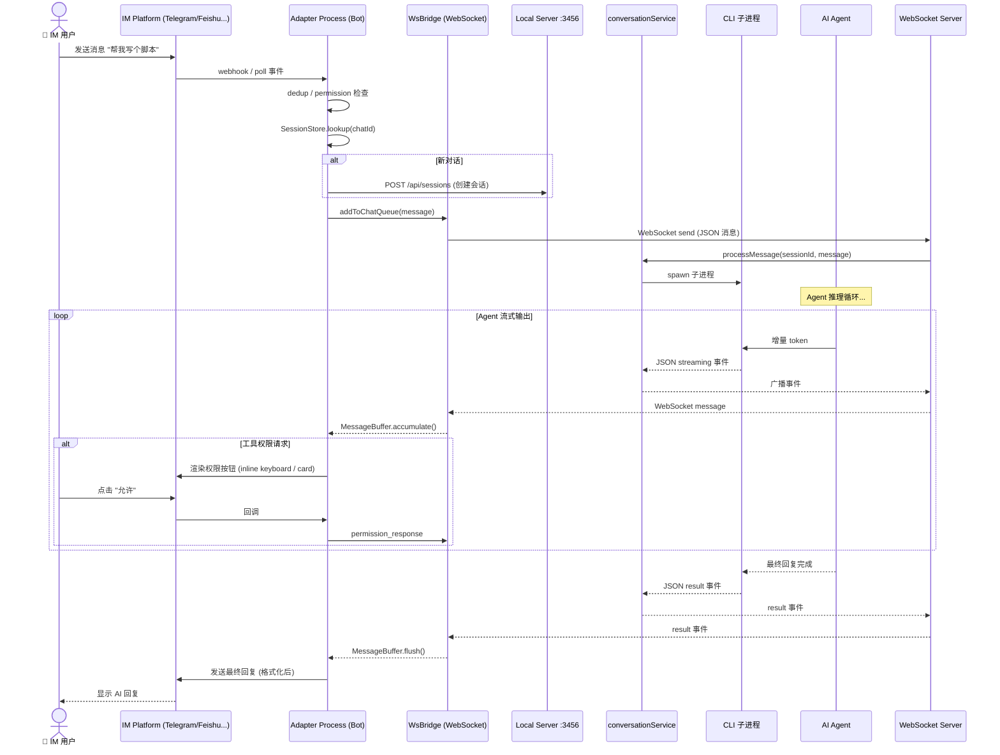
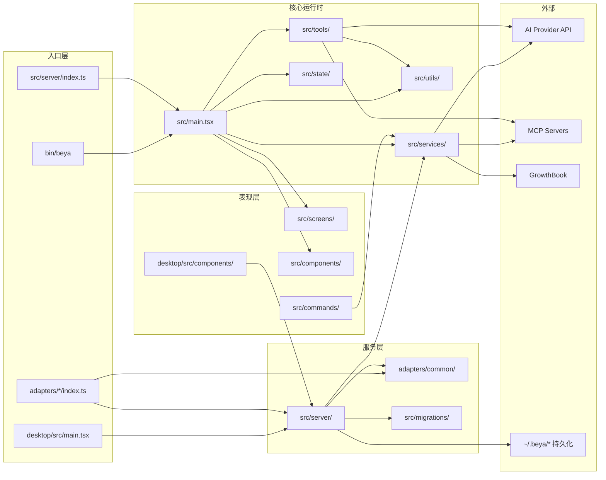

# Beya 项目架构图 & 运行时序图

## 1. 系统架构图

```mermaid
graph TB
    subgraph CLI["CLI (Bun/Ink TUI)"]
        ENTRY["bin/beya → cli.tsx"]
        MAIN["main.tsx (Commander)"]
        REPL["REPL.tsx (交互式终端)"]
        QUERY["QueryEngine (无头模式)"]
        COMMANDS["commands/ (斜杠命令)"]
        SCREENS["screens/ (TUI 页面)"]
        COMPONENTS["components/ (Ink 组件)"]
    end

    subgraph DESKTOP["Desktop App (React+Tauri)"]
        APP["App.tsx"]
        SHELL["AppShell (侧栏/标签页/状态栏)"]
        D_COMPONENTS["components/ (chat/layout/settings)"]
        STORES["stores/ (Zustand 状态)"]
        D_API["api/ (REST + WS 客户端)"]
        TAURI["src-tauri/ (Rust 原生层)"]
    end

    subgraph SERVER["Local Server :3456"]
        HTTP["HTTP API /api/*"]
        WS["WebSocket /ws/:sessionId"]
        SESSION_SVC["sessionService"]
        CONV_SVC["conversationService (CLI 子进程管理)"]
        PROVIDER_SVC["providerService"]
        SETTINGS_SVC["settingsService"]
        DIAG_SVC["diagnosticsService"]
        TEAM_SVC["teamWatcher / cronScheduler"]
    end

    subgraph ADAPTERS["IM Adapters"]
        TG["Telegram (grammY)"]
        FS["Feishu (Lark SDK)"]
        WC["WeChat Official"]
        DT["DingTalk"]
        COMMON["common/ (WsBridge, ChatQueue, SessionStore, Permission)"]
    end

    subgraph CORE["Core Runtime"]
        TOOLS["tools/ (~60 个工具: Bash, FileEdit, Glob, Task, Agent...)"]
        SERVICES["services/ (API, MCP, OAuth, 插件, LSP, 分析...)"]
        UTILS["utils/ (~357 个工具函数)"]
        STATE["state/ (应用状态)"]
        CONTEXT["context/ (React Context)"]
    end

    subgraph SHARED["Shared Persistence"]
        SETTINGS["~/.beya/settings.json"]
        PROVIDERS["~/.beya/providers.json"]
        SESSIONS["~/.beya/projects/*.jsonl"]
        MCP_CONFIG[".mcp.json"]
        SKILLS[".claude/skills"]
    end

    subgraph PRODUCTS["Product Services"]
        PROVIDER_API["Anthropic / OpenAI / 自定义 Provider"]
        MCP_SERVERS["MCP Servers (外部)"]
        FEATURE_FLAGS["GrowthBook (特性开关)"]
        TELEMETRY["遥测 / 分析"]
    end

    %% CLI internal
    ENTRY --> MAIN
    MAIN --> REPL
    MAIN --> QUERY
    MAIN --> COMMANDS
    REPL --> SCREENS
    REPL --> COMPONENTS
    MAIN --> TOOLS
    MAIN --> SERVICES
    MAIN --> UTILS
    MAIN --> STATE
    MAIN --> CONTEXT

    %% Desktop internal
    APP --> SHELL
    SHELL --> D_COMPONENTS
    SHELL --> STORES
    D_API --> STORES
    D_API --> TAURI

    %% Server internal
    HTTP --> SESSION_SVC
    HTTP --> CONV_SVC
    HTTP --> PROVIDER_SVC
    HTTP --> SETTINGS_SVC
    HTTP --> TEAM_SVC
    HTTP --> DIAG_SVC
    WS --> CONV_SVC
    SESSION_SVC --> SHARED

    %% Adapters internal
    TG --> COMMON
    FS --> COMMON
    WC --> COMMON
    DT --> COMMON

    %% Cross-process connections
    DESKTOP -->|"REST + WebSocket"| SERVER
    ADAPTERS -->|"WebSocket (WsBridge)"| SERVER
    SERVER -->|"spawn 子进程"| CLI
    CLI -->|"读写"| SHARED
    SERVER -->|"读写"| SHARED
    DESKTOP -->|"读写 (Tauri)"| SHARED

    %% Core connects to external
    SERVICES --> PROVIDER_API
    SERVICES --> MCP_SERVERS
    SERVICES --> FEATURE_FLAGS
    SERVICES --> TELEMETRY
```

---

## 2. 运行时序图 — 典型对话流程 (Desktop → Server → CLI → Agent → 工具调用)

```mermaid
sequenceDiagram
    actor User as 👤 用户 (Desktop)
    participant App as Desktop App (React)
    participant Store as Zustand Store
    participant API as Desktop API Client
    participant HTTP as Server HTTP API
    participant Session as sessionService
    participant Conv as conversationService
    participant CLI as CLI 子进程 (stream-json)
    participant Agent as AI Agent 核心
    participant Tool as 工具 (Bash/FileEdit...)
    participant Provider as AI Provider (Anthropic/OpenAI...)
    participant MCP as MCP Server (可选)
    participant WS as WebSocket Server
    participant WSC as WebSocket Client

    %% 初始化阶段
    rect rgb(240, 248, 255)
        Note over User,WSC: 1. 初始化 & 会话创建
        User->>App: 打开 Desktop App
        App->>API: GET /api/sessions (加载历史会话)
        API->>HTTP: HTTP Request
        HTTP->>Session: listSessions()
        Session-->>App: 会话列表
        User->>App: 新建会话 / 选择已有会话
        App->>API: POST /api/sessions
        API->>HTTP: HTTP Request
        HTTP->>Session: createSession()
        Session-->>App: sessionId
    end

    %% WebSocket 连接
    rect rgb(255, 250, 240)
        Note over User,WSC: 2. WebSocket 连接建立
        App->>WSC: new WebSocket(`/ws/${sessionId}`)
        WSC->>WS: 连接
        WS-->>WSC: 已连接
        WS->>Conv: registerClient(sessionId)
    end

    %% 用户发送消息
    rect rgb(240, 255, 240)
        Note over User,WSC: 3. 用户发送消息
        User->>App: 输入消息 / 上传文件
        App->>Store: addUserMessage()
        App->>API: POST /api/sessions/:id/messages
        API->>HTTP: Request (user message)
        HTTP->>Conv: sendMessage(sessionId, message)
        Conv->>CLI: spawn 子进程 (beya -p "用户消息")
        Note over CLI: CLI 进程启动，加载核心运行时
        CLI->>Agent: 初始化 Agent (加载 system prompt, 上下文, 工具列表, 权限)
    end

    %% Agent 推理 & 工具调用循环
    rect rgb(255, 245, 238)
        Note over User,WSC: 4. Agent 推理 & 工具调用循环
        loop 推理-工具循环 (直到 Agent 生成最终回复)
            Agent->>Provider: POST /messages (stream 模式)
            Provider-->>Agent: SSE 流式返回 (思考/工具调用/文本)
            Agent->>CLI: 输出增量 token

            alt Agent 决定调用工具
                Agent->>CLI: tool_use (工具名称 + 参数)
                CLI-->>Conv: JSON 事件 (tool_use)
                Conv-->>WS: 广播 tool_use 事件

                alt 需要用户确认工具使用
                    WS-->>WSC: permission_request
                    WSC->>Store: pendingPermission
                    Store->>App: 显示权限确认 UI
                    User->>App: 允许 / 拒绝
                    App->>WSC: permission_response
                    WSC->>WS: 确认结果
                end

                Agent->>Tool: 执行工具
                Note over Tool: 可能调用 MCP 工具<br/>可能执行 Bash 命令<br/>可能读写文件

                alt MCP 工具
                    Tool->>MCP: JSON-RPC 请求
                    MCP-->>Tool: JSON-RPC 响应
                end

                Tool-->>Agent: tool_result
                Agent->>CLI: 输出 tool_result
                CLI-->>Conv: JSON 事件 (tool_result)
                Conv-->>WS: 广播 tool_result
            end
        end
    end

    %% 最终响应
    rect rgb(255, 240, 255)
        Note over User,WSC: 5. 最终响应 & 持久化
        Agent->>CLI: 最终文本响应 (或 result)
        CLI-->>Conv: JSON 事件 (result / assistant message)
        Conv-->>WS: 广播 assistant message + 使用统计
        WS-->>WSC: 最终消息事件
        WSC->>Store: addAssistantMessage()
        Store->>App: 渲染消息到 UI

        Conv->>Session: 持久化消息到 JSONL
        Session-->>SHARED: 写入 ~/.beya/projects/xxx.jsonl

        Session->>Session: 更新 token 用量统计
        Session->>Session: 更新会话标题 (可选)

        Conv->>CLI: 关闭子进程
    end

    Note over User,WSC: ✅ 对话完成，UI 展示最终结果
```

---

## 3. 适配器消息流时序图 (IM → Server → Agent → IM)

```mermaid
sequenceDiagram
    actor IMUser as 👤 IM 用户
    participant IM as IM Platform (Telegram/Feishu...)
    participant Adapter as Adapter Process (Bot)
    participant WsBridge as WsBridge (WebSocket)
    participant Server as Local Server :3456
    participant Conv as conversationService
    participant CLI as CLI 子进程
    participant Agent as AI Agent
    participant WS as WebSocket Server

    IMUser->>IM: 发送消息 "帮我写个脚本"
    IM->>Adapter: webhook / poll 事件
    Adapter->>Adapter: dedup / permission 检查
    Adapter->>Adapter: SessionStore.lookup(chatId)
    alt 新对话
        Adapter->>Server: POST /api/sessions (创建会话)
    end
    Adapter->>WsBridge: addToChatQueue(message)
    WsBridge->>WS: WebSocket send (JSON 消息)
    WS->>Conv: processMessage(sessionId, message)
    Conv->>CLI: spawn 子进程

    Note over Agent: Agent 推理循环...

    loop Agent 流式输出
        Agent->>CLI: 增量 token
        CLI-->>Conv: JSON streaming 事件
        Conv-->>WS: 广播事件
        WS-->>WsBridge: WebSocket message
        WsBridge-->>Adapter: MessageBuffer.accumulate()

        alt 工具权限请求
            Adapter->>IM: 渲染权限按钮 (inline keyboard / card)
            IMUser->>IM: 点击 "允许"
            IM->>Adapter: 回调
            Adapter->>WsBridge: permission_response
        end
    end

    Agent-->>CLI: 最终回复完成
    CLI-->>Conv: JSON result 事件
    Conv-->>WS: result 事件
    WS-->>WsBridge: result 事件
    WsBridge-->>Adapter: MessageBuffer.flush()
    Adapter->>IM: 发送最终回复 (格式化后)
    IM-->>IMUser: 显示 AI 回复
```

---

## 4. 模块依赖图

```mermaid
graph LR
    subgraph "入口层"
        A[bin/beya]
        B[desktop/src/main.tsx]
        C[adapters/*/index.ts]
        D[src/server/index.ts]
    end

    subgraph "核心运行时"
        E[src/main.tsx]
        F[src/services/]
        G[src/tools/]
        H[src/utils/]
        I[src/state/]
    end

    subgraph "表现层"
        J[src/screens/]
        K[src/components/]
        L[desktop/src/components/]
        M[src/commands/]
    end

    subgraph "服务层"
        N[src/server/]
        O[adapters/common/]
        P[src/migrations/]
    end

    subgraph "外部"
        Q[AI Provider API]
        R[MCP Servers]
        S[GrowthBook]
        T[~/.beya/* 持久化]
    end

    A --> E
    B --> N
    C --> O
    C --> N
    D --> E

    E --> F
    E --> G
    E --> H
    E --> I
    E --> J
    E --> K

    N --> F
    N --> P
    N --> O
    N --> T

    F --> Q
    F --> R
    F --> S

    G --> H
    G --> R
    G --> Q

    L --> N
    M --> F
```
