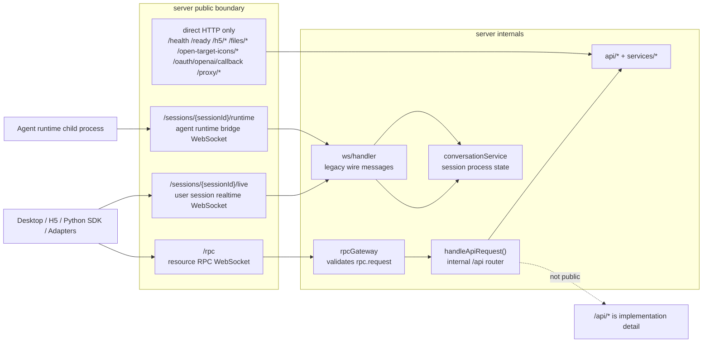
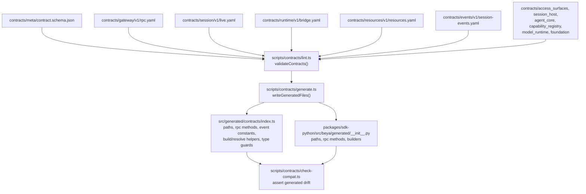
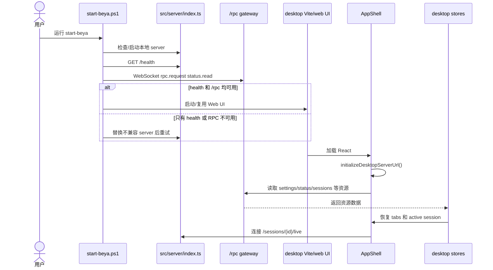
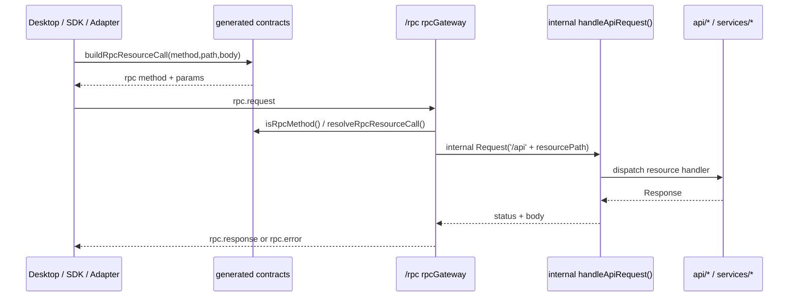
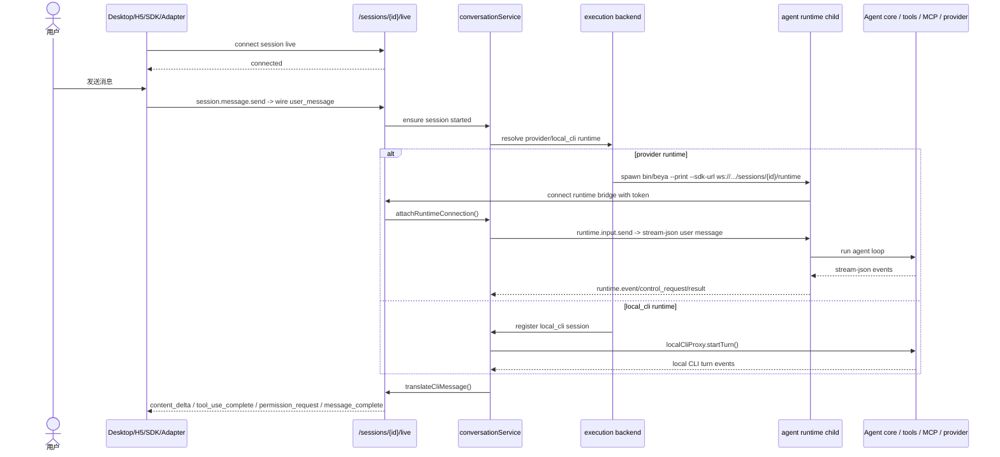

# Beya 真实项目架构图

> 依据当前仓库文件扫描整理。扫描时排除了依赖和构建输出：`node_modules/`、`desktop/node_modules/`、`adapters/node_modules/`、`desktop/dist/`、`desktop/src-tauri/target/`、`artifacts/`、`.git/`。

## 扫描结论

- 当前仓库是一个 Bun Coding Agent 产品仓库，不是单一前端项目：包含 CLI/TUI、本地 Bun server、Tauri/React desktop、Python SDK、IM adapters、contracts/codegen、docs 和 release/quality scripts。
- 外部主通信入口已经是三条 WebSocket：`/rpc`、`/sessions/{sessionId}/live`、`/sessions/{sessionId}/runtime`。
- `/api/*` 没有作为外部 HTTP 主入口暴露；它仍作为 server 内部资源 router，由 `/rpc` gateway 转发到 `handleApiRequest()`。
- `contracts/` 是协议源，`scripts/contracts/*` 生成 TypeScript/Python 协议产物；当前生成 hash 为 `e5ed374ce5325bb7`。
- `session.live` 已经用 contract 名称约束客户端调用，但 server 内部仍映射到 legacy wire type，例如 `session.message.send -> user_message`。
- `event bus` 已落地，但当前只覆盖少量 session/runtime 事件，还没有替代所有跨模块调用。
- `provider` runtime 和 `local_cli` runtime 是两条不同执行路径：provider 模式启动 agent runtime 子进程并连接 `/sessions/{id}/runtime`；local CLI 模式由 server 内部 `localCliProxy` 驱动，不走 runtime WebSocket。

## 总体架构

```mermaid
flowchart TB
  User["用户"]

  subgraph Entrypoints["产品入口"]
    CLI["bin/beya\nBun CLI / Ink TUI"]
    Start["start-beya.ps1 / start-beya.cmd\n本地启动器"]
    Desktop["desktop/\nReact + Tauri UI"]
    H5["H5/browser UI\nserver static fallback"]
    PySDK["packages/sdk-python\nProduct SDK"]
    Adapters["adapters/\nTelegram / Feishu / WeChat / DingTalk"]
  end

  subgraph Contracts["contracts + codegen"]
    YAML["contracts/**/*.yaml\n协议源"]
    Schema["contracts/meta/contract.schema.json"]
    Codegen["scripts/contracts\nlint / generate / check-compat"]
    GenTS["src/generated/contracts"]
    GenPY["packages/sdk-python/src/beya/generated"]
  end

  subgraph Server["src/server 本地服务"]
    ServerIndex["index.ts\nBun.serve transport boundary"]
    RpcGw["ws/rpcGateway.ts\n/rpc resource RPC"]
    LiveWs["ws/handler.ts\n/sessions/{id}/live"]
    RuntimeBridge["runtime bridge\n/sessions/{id}/runtime"]
    Router["router.ts\ninternal /api resource router"]
    Services["services/*\nsession/provider/settings/mcp/tools/etc"]
    Conv["conversationService.ts\nruntime process manager"]
    Exec["execution/*\nprovider vs local_cli routing"]
    EventBus["events/eventBus.ts\ntyped internal event bus"]
  end

  subgraph AgentRuntime["Agent runtime / core"]
    ProviderChild["provider runtime child process\nbin/beya --print --sdk-url ..."]
    LocalCLI["local CLI runtime\nlocalCliProxy"]
    AgentCore["src/main.tsx / QueryEngine / tools / MCP / providers"]
  end

  subgraph Storage["用户态持久化"]
    BeyaHome["~/.beya/*"]
    ProjectLogs["~/.beya/projects/**/*.jsonl"]
    McpConfig[".mcp.json / managed MCP config"]
    DesktopState["desktop localStorage / Tauri state"]
  end

  User --> Desktop
  User --> CLI
  User --> H5
  Start --> ServerIndex
  Start --> Desktop

  YAML --> Schema
  YAML --> Codegen
  Codegen --> GenTS
  Codegen --> GenPY
  GenTS --> RpcGw
  GenTS --> LiveWs
  GenTS --> Desktop
  GenTS --> Adapters
  GenPY --> PySDK

  Desktop -->|WebSocket /rpc| RpcGw
  PySDK -->|WebSocket /rpc| RpcGw
  Adapters -->|WebSocket /rpc| RpcGw
  Desktop -->|WebSocket /sessions/{id}/live| LiveWs
  H5 -->|WebSocket /sessions/{id}/live| LiveWs
  PySDK -->|WebSocket /sessions/{id}/live| LiveWs
  Adapters -->|WebSocket /sessions/{id}/live| LiveWs

  ServerIndex --> RpcGw
  ServerIndex --> LiveWs
  ServerIndex --> RuntimeBridge
  RpcGw --> Router
  Router --> Services
  LiveWs --> Conv
  Conv --> Exec
  Conv --> EventBus
  Services --> EventBus

  Exec --> ProviderChild
  ProviderChild -->|WebSocket /sessions/{id}/runtime| RuntimeBridge
  RuntimeBridge --> Conv
  Exec --> LocalCLI
  ProviderChild --> AgentCore
  LocalCLI --> AgentCore

  Services --> BeyaHome
  Services --> ProjectLogs
  Services --> McpConfig
  Desktop --> DesktopState
```

## Server 边界



## Contract 与 Codegen



## 启动时序：start-beya 到页面可用



## 资源 RPC 时序



## 会话与 Runtime 时序



## 当前残余与风险点

- `architecture-diagrams.md` 原内容已过期：旧图仍写 `/ws/:sessionId`、外部 `/api/*`，已被本文件替换为当前真实路径。
- `src/server/ws/events.ts` 仍维护 session live 的 wire shape；生成的 contract 目前负责统一命名和构造消息，还不是完整 payload schema 校验。
- `resources.request` 仍是受控 generic RPC escape hatch；这让迁移更稳，但也说明 RPC method 还不是 100% 显式化。
- Python SDK 内部 resource 方法仍写 `/api/...` 字符串，但 `_request()` 会调用生成的 `build_rpc_resource_call()` 并通过 `/rpc` 发送；这是内部命名残留，不是外部 HTTP 调用。
- 代码里仍有 `src/entrypoints/sdk/*`、`src/types/sdkProtocol.ts` 等名称；这些多属于 CLI/runtime 内部 SDK protocol 或第三方 SDK import，不等于旧 `/sdk/{sessionId}` 通道路由。
- `eventBus` 当前只有 `session.created/deleted/runtime.started/runtime.stopped` 等少量生产使用点；如果目标是“内部全部 typed RPC/event bus”，这里还需要继续收敛。
