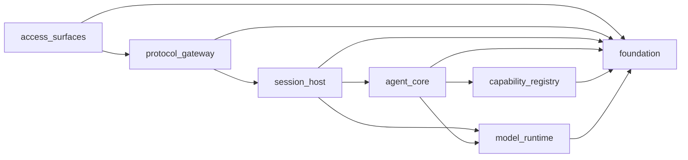

# Beya 架构重整方案

本文先定义目标架构和迁移计划，不直接搬动生产代码。目标是解决两类问题：

- 职责争权：旧入口、新入口、兼容别名和业务实现同时存在，导致控制权不清晰。
- 模块失焦：工具、UI、server、provider、持久化互相引用，优化一个功能容易牵动多处。

变更面：`docs`。后续代码迁移会按 `server`、`agent-loop`、`provider/runtime`、`desktop`、`adapter` 分阶段进入。

顶层板块的完整切割结果见 [top-level-cut.md](./top-level-cut.md)。本文保留整体迁移计划，协议细节集中放在仓库根目录 `contracts/`。

## 现状判断

当前代码已经有一些好的方向，但还没有形成统一架构契约：

- `/api/*` 已经是 HTTP 资源 API，并有 `tests/beyaServerSdkContract.test.ts` 保护；实时 WebSocket 通道统一为 `/ws/:sessionId`，非规范 WS 路径不再作为入口保留。
- `RuntimeProfile`、`RuntimeCapabilities` 已经开始统一 provider 与 local CLI 能力，但 provider 配置、代理转换、会话启动仍分散解释运行时能力。
- `server/ws/handler.ts` 同时承担 WebSocket 传输、runtime 选择、预热、标题生成、桌面 slash command、权限转译、会话清理和事件翻译。
- `Tool.ts` 同时定义运行时工具契约和 React/Ink 渲染契约，导致 agent runtime 与 CLI UI 互相粘连。
- `src/utils` 不是纯基础工具层，存在引用 services、tools、UI 的反向依赖，是环状结构风险最大的区域。
- Desktop 的 `types/chat`、Server 的 `ws/events.ts`、Adapter 的 `ws-bridge.ts` 各自维护相似消息形状，容易协议漂移。
- `CLAUDE_*` 兼容环境变量和 no-op compatibility shim 文件仍在多处暴露，需要集中到兼容层并设退役策略。
- `src/server/services/mcDesign*` 这类领域能力位于 server services 中，后续应作为 capability/domain pack，而不是 Server 核心职责。

## 目标分层

顶层保持 7 个板块，满足同层级 3-10 个板块的约束。每个板块内部也控制在 3-10 个二级模块，超过 10 个必须继续归并，少于 3 个要考虑是否只是另一个板块的子模块。

| 板块 | 职责 | 不负责 |
| --- | --- | --- |
| `access_surfaces` 接入面 | Desktop、CLI shell、H5、IM、SDK 的用户入口 | Agent 推理、provider 选择、持久化写入 |
| `protocol_gateway` 协议网关 | `/api/*`、session WebSocket、认证、CORS、H5 静态入口 | 会话生命周期、工具执行、模型调用 |
| `session_host` 会话宿主 | session lifecycle、agent runtime 进程、worktree、标题、调度 | UI 渲染、provider 请求转换、工具实现 |
| `agent_core` Agent 内核 | query loop、消息模型、上下文、权限、工具编排、subagent 编排 | 传输协议、桌面状态、provider 存储 |
| `capability_registry` 能力目录 | tools、skills、plugins、MCP、agents、workflows、领域能力包 | UI 呈现、会话进程管理、provider 认证 |
| `model_runtime` 模型运行时 | provider/local CLI 运行时、模型目录、代理转换、usage/context telemetry | UI、session transport、具体工具业务 |
| `foundation` 基础设施 | 配置、持久化、路径/文件系统、安全策略、诊断、质量/发布脚本 | 业务路由、Agent 逻辑、用户界面 |

目标依赖方向：

禁止方向：

- `foundation` 禁止 import 任何业务板块。
- `model_runtime` 禁止 import `agent_core`、`session_host`、`protocol_gateway`、`access_surfaces`。
- `capability_registry` 禁止直接 import UI；工具展示通过 presentation adapter 注入。
- `agent_core` 禁止 import Desktop、Server WebSocket handler、IM adapter。
- `protocol_gateway` 禁止直接调用 provider API 或工具实现，只能调用 `session_host` 端口。
- `access_surfaces` 禁止直接读写 `~/.beya` 业务状态，必须通过 API 或明确的本地 UI 偏好存储。

## 统一协议

协议统一放在仓库根目录 `contracts/` 中，不能散落到 `src/`、`desktop/`、`adapters/`、`docs/` 等目录里。协议包和 7 个架构板块同构：`contracts/` 内的分类文件夹对应架构板块，每个分类文件夹内有和板块同名的 YAML 文件以及该板块拥有的小协议文件。这些文件夹只是协议包内部的阅读分组，不代表生产代码目录。这里不设置根索引协议文件，目录结构本身就是索引，避免再次形成中心化大文件。协议包不是最终代码生成器，但后续应成为以下内容的单一来源：

- 板块层级和依赖边界。
- HTTP/WS 路径命名规范。
- session runtime 进程消息。
- capability manifest。
- provider/runtime profile。
- 持久化与兼容别名退役计划。

选择 YAML 的原因：读写简单、已有 `yaml` 依赖、适合中文注释、适合作为后续校验脚本输入。单个协议文件优先控制在 120 行以内，超过 160 行必须继续拆分，避免协议文件本身变成新的“大而全”模块。

## 新旧路线融合

第一批应该收敛的路线：

| 当前路线 | 目标路线 | 处理 |
| --- | --- | --- |
| 分散的实时通道命名 | `/ws/:sessionId` | Server 合约测试必须拒绝非规范 WS 路径 |
| Desktop/Python SDK/Adapter 各自维护 WS 消息类型 | `session_ws` 协议 | 先共享类型定义，再考虑由 YAML 生成 TS/Python 类型 |
| provider 与 local CLI 分散判断能力 | `RuntimeProfile` | 将能力判断收敛到 `model_runtime` |
| `Tool.ts` 混合运行时和 UI 渲染 | `ToolRuntimeContract` + `ToolPresentationContract` | Agent 内核只依赖 runtime contract |
| `src/utils` 同时做基础工具和业务工具 | `foundation` + 各领域私有 utils | 先冻结反向依赖，再逐步搬迁 |
| `CLAUDE_*` 兼容变量散落 | `foundation.compat` | 产品代码只读 `BEYA_*`，兼容转换集中处理 |
| `mcDesign*` 放在 server services | domain capability pack | 从 server 核心迁出，按 capability manifest 注册 |

## 迁移计划

### 阶段 0：冻结契约

- 落地本文和 YAML 协议。
- 将顶层 7 板块作为后续 PR 的 changed surface 补充维度。
- 对 `/api/*` canonical 路径、WS canonical 路径、RuntimeProfile 增加或整理合约测试。

验收：

- 文档可读。
- `bun run check:impact` 能识别文档变更。

### 阶段 1：协议网关收敛

- Desktop 和 Python SDK 改为 `/ws/:id`。
- Server 拒绝非规范 WS 路径，用合约测试证明只有 `/ws/:id` 接入。
- Desktop、SDK、Adapter 的 `ClientMessage` / `ServerMessage` 对齐到同一个协议定义。

建议验证：

- `cd adapters && bun test`
- `bun run check:server-contract`
- `cd desktop && bun run test -- websocket`

### 阶段 2：拆薄 WebSocket handler

- `server/ws/handler.ts` 拆为 transport、session command adapter、event translator、connection registry。
- runtime 切换、prewarm、title 生成移入 `session_host` 子模块。
- transport 层只处理认证、连接生命周期、协议消息分发。

建议验证：

- `bun run check:server`
- Desktop 可见聊天流做一次 browser/desktop smoke。

### 阶段 3：运行时内核去 UI 化

- 拆分 `Tool.ts`：
  - runtime contract：schema、permission、execution、result mapping。
  - presentation contract：Ink/React 渲染、搜索展示、分组展示。
- `agent_core` 不再 import `src/components` 或 Desktop。
- `AgentTool`/subagent 编排从普通 tool registry 中抽到 `agent_core` 的 agent orchestration 端口。

建议验证：

- 重点跑 agent-loop、tool execution、permission mock tests。
- `bun run check:server`
- 核心路径进入 PR-ready 时跑 `bun run verify`。

### 阶段 4：Provider/runtime 正式统一

- 以 `RuntimeProfile` 作为 provider 和 local CLI 的唯一能力描述。
- `ProviderService` 拆为 provider storage、auth/env builder、model discovery、proxy pipeline test。
- 代理转换只属于 `model_runtime.proxy`，Server API 只暴露入口。

建议验证：

- provider/runtime 单测。
- `bun run check:server`
- 有凭据时补 live provider smoke。

### 阶段 5：能力目录模块化

- tools、skills、plugins、MCP、workflows 使用统一 capability manifest。
- domain pack 迁出 server services，例如 `mcDesign`。
- capability 只暴露 metadata、runtime executor、permission hints，不直接拥有 UI。

建议验证：

- tool/plugin/skill 合约测试。
- `bun run check:server`

### 阶段 6：基础层与边界校验

- 清理 `src/utils` 反向依赖：基础工具留在 `foundation`，领域工具回到所属板块。
- 引入 import-boundary 测试或脚本，禁止形成环。
- 将兼容 shim 列入退役表，做到每个兼容入口都有 owner、截止条件和测试。

建议验证：

- `bun run check:policy`
- `bun run verify`

## 代码移动原则

- 每个 PR 只移动一个板块或一个协议面。
- 每次迁移先补合约测试，再搬实现。
- 兼容别名先转发、再打日志、再禁止新调用、最后删除；已经完成退役的入口不再写回兼容协议。
- 不能用“shared utils”承接业务逻辑；共享必须是协议或纯基础能力。
- 同层级超过 10 个子模块时先归类，不新增第 11 个并列板块。

## 首批建议任务

1. 将 Desktop 和 Python SDK WebSocket 改到 `/ws/:id`，并用拒绝测试锁住非规范 WS 路径不再接入。
2. 为 `session_ws` 提取共享 TS 类型，Desktop 与 Server 同源。
3. 拆 `server/ws/handler.ts` 的事件翻译函数，先不改变行为。
4. 给 `src/utils` 建 import 边界报告，列出反向依赖清单。
5. 拆 `Tool.ts` 的 presentation 字段，先通过 adapter 保持旧调用。
