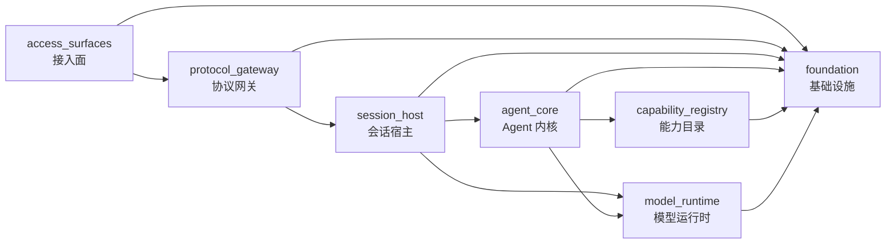

# 顶层板块切割

本阶段只切顶层架构，不搬生产代码。目标是先把 7 个顶层板块的职责、协议、依赖方向和冗余路线收敛规则定死，再按板块向下迁移实现。

## 切割结果

| 顺序 | 板块 | 唯一职责 | 对外协议 | 必须收敛的旧路线 |
| --- | --- | --- | --- | --- |
| 1 | `access_surfaces` 接入面 | 用户和外部系统入口 | `http_api`、`session_ws` | Adapter 私有 WS 语义、入口层直接写业务状态 |
| 2 | `protocol_gateway` 协议网关 | HTTP/WS 传输、认证和错误映射 | `http_api`、`route_naming`、`session_ws` | 顶层 `/health`、公开 `/api/v1/*` |
| 3 | `session_host` 会话宿主 | session 生命周期和 runtime 进程宿主 | `runtime_process`、`persistence` | WS handler 内的 runtime 选择、预热、标题生成 |
| 4 | `agent_core` Agent 内核 | turn loop、上下文、权限和工具编排 | `agent_turn` | `Tool.ts` 混合 UI、AgentTool 作为普通工具 |
| 5 | `capability_registry` 能力目录 | 能力声明、发现和 executor | `capability_manifest` | server services 内的领域能力、重复工具元数据形状 |
| 6 | `model_runtime` 模型运行时 | provider/local CLI 能力与代理转换 | `provider_runtime` | 分散 provider 能力判断、路由内 proxy transform |
| 7 | `foundation` 基础设施 | 配置、持久化、路径、安全、诊断、质量 | `persistence`、`compatibility` | `src/utils` 承接业务逻辑、散落兼容变量 |

## 依赖主线

## 禁止争权

- 接入面不能决定 provider、session 生命周期或 agent 行为。
- 协议网关不能解释 agent 事件、调用工具或执行 provider proxy。
- 会话宿主不能拥有 HTTP 传输、provider proxy 或具体工具业务。
- Agent 内核不能 import UI、WebSocket handler、IM Adapter 或 session 进程宿主。
- 能力目录不能承接 UI，也不能反向依赖 agent_core。
- 模型运行时不能 import agent_core、session_host、protocol_gateway 或 UI。
- 基础设施不能 import 任何业务板块。

## 顶层整合顺序

1. 协议网关收口：Desktop、SDK、Adapter 统一使用 `/ws/{sessionId}`，非规范 WS 路径不再作为入口保留。
2. 会话宿主抽离：把 `server/ws/handler.ts` 中的 runtime 选择、事件翻译、预热和标题生成迁到 session_host 子模块。
3. Agent 内核去 UI：拆开 `Tool.ts` 的 runtime contract 和 presentation contract。
4. 能力目录归一：tools、skills、plugins、MCP、domain pack 都映射到 `capability_manifest`。
5. 模型运行时归一：provider 与 local CLI 都只通过 `RuntimeProfile` 暴露能力。
6. 基础设施清理：冻结 `src/utils` 反向依赖，业务工具回到所属板块。

## 验收口径

- 顶层仍为 7 个板块，任何新增顶层板块都必须先证明不能归入现有 7 个板块。
- 每个顶层板块内部保持 3-10 个子模块。
- 每个保留的兼容入口都有 owner、退役条件和测试保护；已切除的旧入口必须有拒绝测试。
- 每个代码迁移 PR 只移动一个板块或一个协议面。
- 每次代码迁移先补合约测试，再搬实现。
